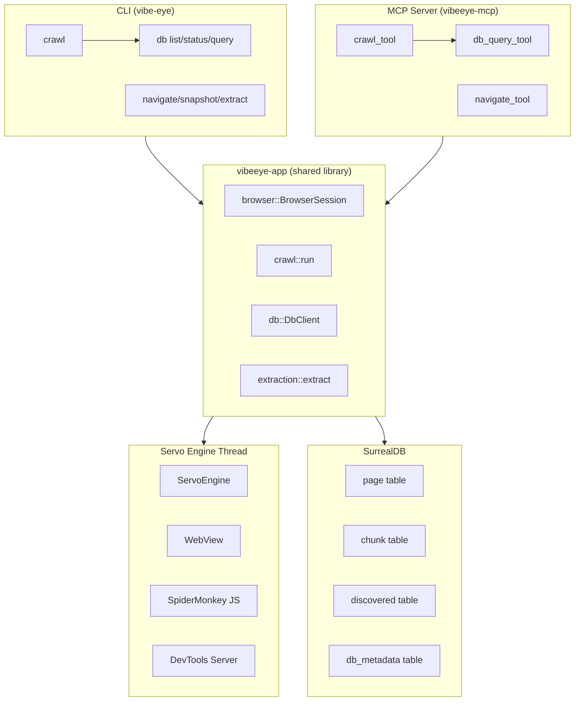
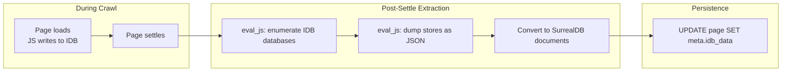

# VibeEye Architecture

## 1. System Overview



---

## 2. Crawl Pipeline — Logic Flow


---

## 3. IndexedDB to SurrealDB Flow



---

## 4. Workspace Layer Diagram

```
┌──────────────────────────────────────────────────────────────────┐
│                    vibeeye-core (domain types)                    │
│  Viewport │ BrowserContext │ NavigationState │ RenderedBuffer    │
│  ContentFormat │ VibeError │ Result<T>                          │
└──────────────────────┬───────────────────────────────────────────┘
                       │ depends on
┌──────────────────────▼───────────────────────────────────────────┐
│                    vibeeye-app (core library)                     │
│                                                                   │
│  ┌─────────────┐  ┌────────────┐  ┌───────────┐  ┌───────────┐  │
│  │  browser/   │  │   crawl/   │  │extraction/│  │    db/    │  │
│  │  mod.rs     │  │  mod.rs    │  │  mod.rs   │  │  client   │  │
│  │  engine.rs  │  │  links.rs  │  │  dom.rs   │  │  schema   │  │
│  │ navigation  │  │  output.rs │  │markdown.rs│  │  ops.rs   │  │
│  │             │  │ validator  │  │           │  │  output   │  │
│  │             │  │  robots.rs │  │           │  │  import   │  │
│  │             │  │ sitemap.rs │  │           │  │  export   │  │
│  └─────────────┘  └────────────┘  └───────────┘  └───────────┘  │
│                                                                   │
│  ┌─────────────┐  ┌────────────┐  ┌───────────┐  ┌───────────┐  │
│  │  chunk/     │  │  embed/    │  │  config/  │  │  tools/   │  │
│  │  mod.rs     │  │ provider.rs│  │  crawl.rs │  │  browse   │  │
│  │             │  │            │  │embeddings │  │  extract  │  │
│  │             │  │            │  │           │  │  snapshot │  │
│  └─────────────┘  └────────────┘  └───────────┘  └───────────┘  │
└──────────────────────┬───────────────────────────────────────────┘
                       │
          ┌────────────┴────────────┐
          ▼                         ▼
┌──────────────────┐   ┌────────────────────────┐
│  vibeeye-cli     │   │   vibeeye-mcp          │
│  (vibe-eye bin)  │   │   (MCP stdio server)   │
│                  │   │                        │
│  cli.rs          │   │  main.rs               │
│  commands.rs     │   │  handler.rs            │
│  format.rs       │   │  tools.rs              │
│  help_tree/      │   │                        │
└──────────────────┘   └────────────────────────┘
```

---


## 5. Thin UI Design Pattern

Both the CLI (`vibeeye-cli`) and the MCP server (`vibeeye-mcp`) are **thin wrappers**
around the same shared library (`vibeeye-app`). Every capability is implemented
exactly once via the unified `TypedTool` trait in `vibeeye-app`, then consumed by both UIs:

```
                      ┌──────────────────────────────┐
                      │     vibeeye-app (shared)     │
                      │  TypedTool + Tool traits     │
                      │  BrowseTool | SnapshotTool   │
                      │  ExtractTool | crawl::run    │
                      │  db::DbClient | Chunker      │
                      │  EmbeddingProvider           │
                      └──────────────┬───────────────┘
                                     │ imports
                           ┌─────────┴─────────┐
                           ▼                   ▼
                ┌──────────────────┐   ┌──────────────────┐
                │   vibeeye-cli    │   │   vibeeye-mcp    │
                │  (vibe-eye bin)  │   │  (MCP stdio svr) │
                │                  │   │                  │
                │  help-tree JSON  │   │  MCP tools/list  │
                │  <- ToolRegistry │   │  <- ToolRegistry  │
                │  direct execute  │   │  dynamic execute │
                └──────────────────┘   └──────────────────┘
```

### Interface parity

The shared `ToolRegistry` in `vibeeye-app` powers both the CLI's `--help-tree`
introspection and the MCP server's `tools/list` and `tools/call` responses. 
The MCP handler dynamically builds its tool list from `ToolRegistry::discover_all()` 
and routes execution directly through `ToolRegistry::execute()`, eliminating any 
duplicate tool definitions between the CLI and MCP layers.

A dedicated [`parity_test`](crates/vibeeye-cli/tests/parity_test.rs) verifies they stay in sync:

```rust
// Verifies that --help-tree -f json exposes the same tools as MCP tools/list
fn cli_help_tree_matches_tool_registry() { ... }
```

### Benefits

- **Single code path.** Bug fixes and features land in `vibeeye-app` and are
  immediately available from both the terminal and AI agent hosts.
- **Consistent capabilities.** Users get the same tools whether they type commands
  or an agent calls MCP tools.
- **Feature gates propagate.** The `surrealdb` and `embeddings` Cargo features gate
  the same code regardless of which UI is in use.

## 6. Feature Gates

| Feature | What it enables | Deps pulled in |
|---------|----------------|----------------|
| *(default)* | Browser tools (navigate, snapshot, extract), crawl to stdout/dir | Servo, scraper |
| `surrealdb` | SurrealDB persistence, DB search, crawl/batch --surrealdb, import/export, MCP DB tools | surrealdb |
| `embeddings` | Chunking, embedding, vector + hybrid search, MCP vector/hybrid tools | tokenizers, reqwest + `surrealdb` |

Build combinations:

```bash
# Minimal (no DB, no embeddings) — everything works except DB persistence
cargo build --release

# With SurrealDB — crawl + persist + search
cargo build --release --features surrealdb

# Full pipeline — crawl → chunk → embed → hybrid search
cargo build --release --features "surrealdb embeddings"
```

---

## 7. CLI / MCP Responsibility Matrix

| Capability | MCP Tool | CLI Command | Reason |
|---|---|---|---|
| Basic crawl (no auth) | `crawl(url)` → returns `needs_cli` | `vibe-eye crawl url` | Long-running; preserve MCP resources |
| SPA with heavy JS | `crawl(url)` → returns CLI command | `vibe-eye crawl url` | Engine auto-detects in CLI |
| Auth required | NOT SUPPORTED — returns `NeedsCli` | `vibe-eye crawl --auth` | Security |
| Large crawl > 100 pages | NOT SUPPORTED — returns CLI command | `vibe-eye crawl --max-pages` | Override in CLI |
| Custom extraction | `crawl(url)` → returns CLI command | `vibe-eye crawl --format --selector` | Power user |
| DB destructive ops | NOT SUPPORTED | `vibe-eye db reset` | Too dangerous |
| DevTools diagnostics | NOT SUPPORTED | `VIBEYE_DEVTOOLS=1 vibe-eye crawl` | External tools |

---

## 8. MCP Tool Return Contract

When a crawl requires user judgment:

```rust
pub struct CrawlToolResult {
    pub success: bool,
    pub pages: Vec<CrawlResult>,
    pub status: CrawlStatus,
    pub message: String,
}

pub enum CrawlStatus {
    Ok,
    NeedsCli {
        reason: String,
        suggested_cli: String,
    },
    Partial {
        crawled: usize,
        failed: usize,
        message: String,
    },
}
```

**MCP tool description:**
> The crawl tool prepares a CLI command for the user to run in their terminal. Crawls are intentionally NOT executed inside MCP because they are long-running operations that can tie up agent resources and block the session. The tool returns `status: "needs_cli"` with a `suggested_cli` command like `vibe-eye crawl <url> --group <group>`.

---

## 9. Database Schema

### Tables

**`page`** (SCHEMAFULL)

| Field | Type | Description |
|-------|------|-------------|
| `id` | `record<page>` | SurrealDB record ID |
| `group` | `string` | Crawl group (sanitized domain) |
| `url` | `string` | Page URL |
| `title` | `option<string>` | Page title |
| `content` | `string` | Extracted content |
| `format` | `string` | Content format (markdown/html/text) |
| `depth` | `int` | BFS depth from seed |
| `crawled_at` | `datetime` | Crawl timestamp |
| `meta` | `object` (FLEXIBLE) | JSON-LD, Open Graph, etc. |

Full-text index: BM25 on `content` with custom analyzer (`doc_analyzer`: BLANK+CLASS+CAMEL tokenizers, LOWERCASE+SNOWBALL filters).

**`discovered`** (RELATION)

| Field | Type | Description |
|-------|------|-------------|
| `id` | `record<discovered>` | SurrealDB record ID |
| `in` | `record<page>` | Source page |
| `out` | `record<page>` | Target page |
| `group` | `string` | Crawl group |
| `anchor_text` | `option<string>` | Link anchor text |
| `discovered_at` | `datetime` | Discovery timestamp |

**`chunk`**

| Field | Type | Description |
|-------|------|-------------|
| `id` | `record<chunk>` | SurrealDB record ID |
| `group` | `string` | Crawl group |
| `page` | `record<page>` | Parent page |
| `chunk_index` | `int` | Position in page |
| `chunk_text` | `string` | Chunk content |
| `heading_path` | `array` | Section hierarchy (e.g., `["Intro", "API"]`) |
| `embedding` | `vector` | Vector embedding |
| `model` | `string` | Embedding model name |
| `dimensions` | `int` | Embedding dimension |

Indexes: `idx_chunk_group`, `idx_chunk_page_index`, HNSW on `embedding` (DIST COSINE, TYPE F32, EFC 150, M 12).

**`db_metadata`**

Key-value store for schema version tracking and other metadata.

### Migrations

| Migration | Description |
|-----------|-------------|
| `001_initial` | Create `page` + `discovered` + BM25 index + `doc_analyzer` |
| `002_add_chunks` | Create `chunk` + `db_metadata` + chunk indexes |
| `003_add_meta` | Add `meta FLEXIBLE` field to `page` table |

---

## 10. Key Architectural Patterns

### Unified Tool Abstraction

To eliminate redundant trait implementations and enable dynamic execution, tools use a dual-trait pattern:
- **`TypedTool`**: A strongly-typed trait defining `Input`, `Output`, and static metadata (`name`, `description`, `input_schema`, `output_schema`). Not object-safe due to associated types.
- **`Tool`**: An object-safe trait for dynamic dispatch, exposing `metadata()` and `execute_json()`.
- **`ToolAdapter<T>`**: A wrapper that adapts any `TypedTool` into the object-safe `Tool` trait, handling JSON serialization/deserialization automatically.

This allows the `ToolRegistry` to store `Box<dyn Tool>` and execute tools dynamically by name, serving both the CLI and MCP from a single source of truth.

### Unified Error Handling

The workspace uses a single, consolidated error type to prevent duplication and information loss:
- **`vibeeye_core::VibeError`**: The single source of truth for all errors (`Browser`, `Navigation`, `Extraction`, `ToolExecution`, `InvalidInput`, `Config`, `Mcp`, `Io`, `Serialization`).
- **`vibeeye_app::Error`**: A simple re-export (`pub use vibeeye_core::VibeError as Error;`) ensuring all app-level code uses the unified type without wrapping it in redundant `Core(...)` variants.

### Process-wide Servo singleton

Only one Servo engine instance exists per process lifetime. Sessions borrow-and-return via `Option::take()`:

```rust
static GLOBAL_ENGINE: OnceLock<Mutex<Option<ServoEngine>>>;

// BrowserSession::new() — takes engine from pool
// BrowserSession::drop() — returns engine to pool
```

### Dedicated engine thread

Servo runs on `std::thread::Builder::new().name("servo-engine")` with a command-channel pattern:

```rust
loop {
    servo.spin_event_loop();
    if let Ok(cmd) = rx.try_recv() {
        handle_command(cmd, &mut servo, &mut webview);
    }
}
```

All interactions via `mpsc::Sender<EngineCommand>` / `oneshot::Receiver`.

### SPA auto-detection

Compares count of `<a href>` in raw HTML vs live DOM. Decision:

```
DOM links > 2× raw links AND DOM links > 5  → Use DOM links (SPA)
Otherwise                                      → Use raw HTML links (static)
```

### Two-phase hybrid search

1. BM25 pre-filter across all chunks → candidate page pool
2. KNN vector search restricted to candidate pages' chunks
3. Adjacent-chunk context expansion around top results

### Hierarchical config merge

`CrawlConfig` merges profiles in order: `global` → `domain."example.com"` → `subdomain."docs.example.com"`. Each level overrides the previous.

---

## 11. Remaining Work

### 10.1 IndexedDB Dump

After page settles, enumerate IndexedDB databases via `eval_js`, dump stores as JSON, and attach to `CrawlResult.meta.idb_data`. **Deferred** because `eval_js` is synchronous while IDB operations are Promise-based, requiring either async JS evaluation support or complex polling in Servo.

- Files: `crates/vibeeye-app/src/crawl/mod.rs`, `crates/vibeeye-app/src/extraction/`

### 10.2 Known Issues

See [`known_issues.md`](known_issues.md) for:
- SurrealDB docs crawl misses sub-pages (Astro SPA)
- GitHub anti-bot blocking (0 chunks expected)
- Servo SpiderMonkey segfault on normal exit (mitigated via `libc::_exit(0)`)
