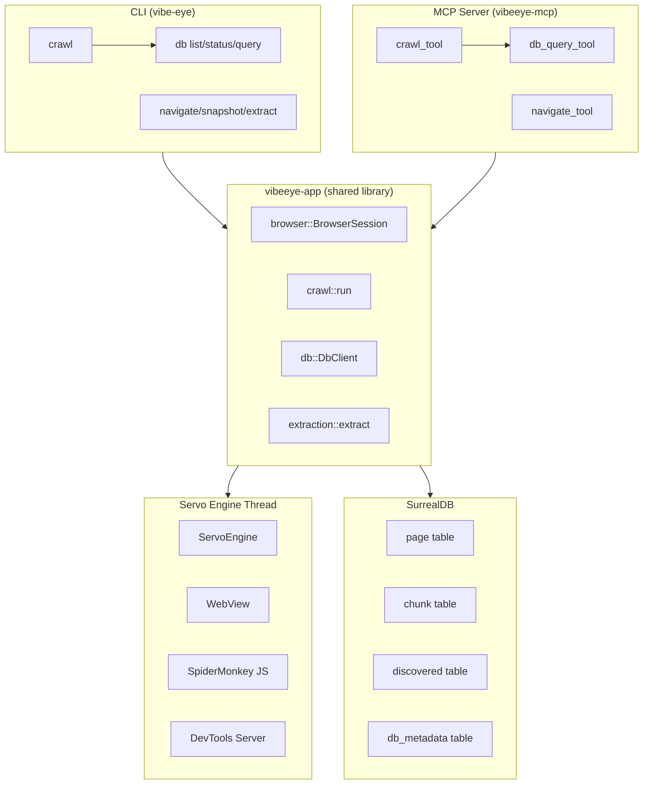
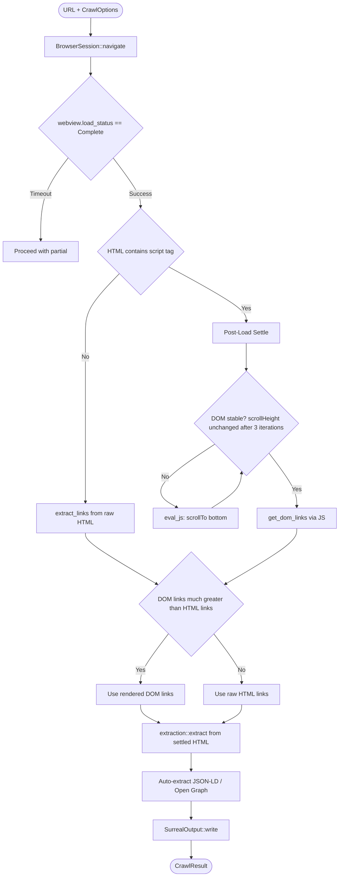
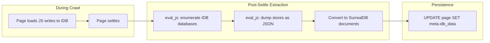

# VibeEye Architecture

## 1. System Overview



---

## 2. Crawl Pipeline - Logic Flow



---

## 3. IndexedDB to SurrealDB Flow



---

## 4. CLI / MCP Responsibility Matrix

| Capability | MCP Tool | CLI Command | Reason |
|---|---|---|---|
| Basic crawl (no auth) | crawl(url) | vibe-eye crawl url | Both supported |
| SPA with heavy JS | crawl(url) - auto-handled | vibe-eye crawl url | Engine auto-detects |
| Auth required | NOT SUPPORTED - returns needs_cli | vibe-eye crawl --auth | Security |
| Large crawl > 100 pages | crawl(url) with warning | vibe-eye crawl --max-pages | Override in CLI |
| Custom extraction | crawl(url) basic | vibe-eye crawl --format --selector | Power user |
| DB destructive ops | NOT SUPPORTED | vibe-eye db reset | Too dangerous |
| DevTools diagnostics | NOT SUPPORTED | VIBEYE_DEVTOOLS=1 vibe-eye crawl | External tools |

---

## 5. MCP Tool Return Contract

When a crawl requires user judgment:

```rust
pub struct CrawlToolResult {
    pub success: bool,
    pub pages: Vec<CrawlResult>,
    pub status: CrawlStatus,
    pub message: String,
}

pub enum CrawlStatus {
    Ok,
    NeedsCli {
        reason: String,
        suggested_cli: String,
    },
    Partial {
        crawled: usize,
        failed: usize,
        message: String,
    },
}
```

**MCP tool description:**
> The crawl tool fetches and extracts content from web pages. It automatically handles JavaScript-rendered pages (SPAs like crates.io). If the page requires authentication or the crawl would be large (>100 pages), the tool will return a status indicating you should prompt the user to run the CLI command: vibe-eye crawl <url> --auth

---

## 6. Module Changes

### 6.1 browser/engine.rs

| Lines | Change |
|---|---|
| 22-35 | Add EvalJs and GetDomLinks to EngineCommand enum |
| 220-253 | Add eval_js_cmd and get_dom_links_cmd handlers |
| 156-215 | Start DevTools server if VIBEYE_DEVTOOLS env var set |

### 6.2 browser/mod.rs

| Lines | Change |
|---|---|
| 96-114 | Add eval_js method |
| 115-132 | Add get_dom_links method |

### 6.3 crawl/mod.rs

| Lines | Change |
|---|---|
| 31-44 | Add settle_ms to CrawlOptions (default 2000) |
| 211-240 | Add post-load settle loop in fetch_with_session |
| 282-297 | Auto-detect SPA, use DOM links when needed |

### 6.4 extraction/mod.rs

| Lines | Change |
|---|---|
| 14-27 | Expand NOISE_SELECTORS |
| 47-54 | Add extract_structured for JSON-LD / Open Graph |

### 6.5 db/ops.rs

| Lines | Change |
|---|---|
| 155-166 | Add update_page_meta method |

### 6.6 db/schema.rs

| Change |
|---|---|
| Add meta field to page table schema |

### 6.7 vibeeye-mcp/tools.rs

| Change |
|---|---|
| Update crawl tool description with prompt-user guidance |
| Return CrawlStatus enum in results |

---

## 7. Implementation Checklist

### Phase 1: Engine Commands ✅
1. [x] Add EvalJs to EngineCommand
2. [x] Add GetDomLinks to EngineCommand
3. [x] Implement eval_js_cmd handler
4. [x] Implement get_dom_links_cmd handler

### Phase 2: BrowserSession API ✅
5. [x] Add eval_js method to BrowserSession
6. [x] Add get_dom_links method to BrowserSession

### Phase 3: Crawl Auto-Detection ✅
7. [x] Add settle_ms to CrawlOptions
8. [x] Detect script tags in initial HTML
9. [x] Implement scroll-settle loop
10. [x] Compare raw vs DOM link counts
11. [x] Use DOM links when appropriate

### Phase 4: Structured Metadata (partial)
12. [x] Add meta field to CrawlResult
13. [ ] Implement JSON-LD extraction
14. [x] Implement Open Graph extraction
15. [ ] Add IndexedDB dump script

### Phase 5: SurrealDB Schema ✅
16. [x] Update page table schema with meta field
17. [x] Add update_page_meta to DbClient

### Phase 6: MCP Tool Contract
18. [ ] Update crawl tool description
19. [ ] Add CrawlStatus enum to results

### Phase 7: DevTools Integration ✅
20. [x] Add VIBEYE_DEVTOOLS env var check
21. [x] Configure DevTools on random port
22. [x] Add --devtools CLI flag

### Phase 8: Testing
23. [ ] Test crates.io crawl
24. [ ] Test GitHub repo crawl
25. [ ] Verify book.servo.org no regression
26. [ ] Verify hybrid search still works

---

## 8. Remaining Work (Building-Block Order)

Each phase builds on the previous:

### 8.1 JSON-LD Extraction (Phase 4)
Extract JSON-LD structured data from `<script type="application/ld+json">` tags
and store in `CrawlResult.meta`. Complements existing Open Graph extraction.
- File: `crates/vibeeye-app/src/extraction/dom.rs`
- Depends on: nothing new (meta field already exists)

### 8.2 IndexedDB Dump (Phase 4)
After page settles, enumerate IndexedDB databases via `eval_js`, dump stores
as JSON, and attach to `CrawlResult.meta.idb_data`. Enables archiving
client-side state from SPAs.
- Files: `crates/vibeeye-app/src/crawl/mod.rs` (post-settle hook),
  `crates/vibeeye-app/src/extraction/` (new IDB script)
- Depends on: 8.1 (shares meta field plumbing)

### 8.3 MCP Tool Contract (Phase 6)
Add `CrawlStatus` enum with `Ok`/`NeedsCli`/`Partial` variants to MCP tool
results. Update crawl tool description to guide agents toward CLI for auth
or large crawls.
- Files: `crates/vibeeye-mcp/src/tools.rs`
- Depends on: 8.2 (full extraction pipeline should be stable first)

### 8.4 End-to-End Testing (Phase 8)
Test crawls against real-world targets to validate the full pipeline.
- crates.io (SPA with JS rendering)
- GitHub repo (mixed static + JS)
- book.servo.org (regression check)
- Hybrid search quality validation
- Depends on: 8.3 (MCP contract affects test surface)
